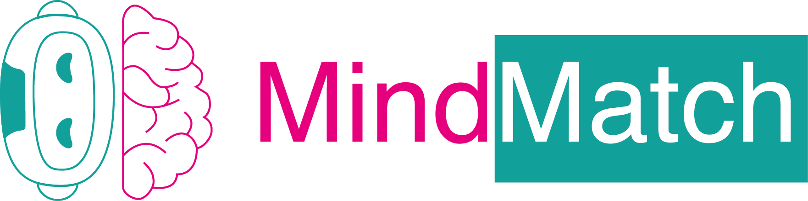

# MindMatch: Compare Your Thinking Patterns to ChatGPT

MindMatch is an interactive platform designed to compare human thinking patterns with those of ChatGPT. It's a fascinating way to understand the similarities and differences between human and artificial intelligence reasoning.

## Features

- **Interactive Quizzes:** Test your knowledge and reasoning skills against leading language models and AI systems.
- **Instant Feedback:** Immediately see how you fared compared to both peers and AI.
- **Educational Insights:** Learn more about AI capabilities and limitations through direct comparison.

## How It Works

1. **Explore Quizzes:** Browse available quizzes from the sidebar.
2. **Choose a Quiz:** Select to see a brief explanation, its scope, and how to interpret your scores.
3. **Take the Challenge:** Engage with the quiz and compare your results with AI.
4. **Continuous Learning:** Navigate back anytime to explore other quizzes.

## Getting Started

To get started with MindMatch, follow these steps:

1. Clone the repository to your local machine.
2. Install the required dependencies by running `pip install -r requirements.txt`.
3. Run the application using Streamlit with the command `streamlit run your_app.py`.

## Contributions

MindMatch is an open-source project made possible by the contributions of:

- Gabriel Hamalwa
- Heather Dyett
- Hillary Hauger
- Jannes Elstner
- Julius Hege
- Richard Schwank

We appreciate the community's support and feedback to improve this platform. If you have any suggestions or wish to contribute, please visit our GitHub repository.

## Support and Feedback

For support, feature requests, or to provide feedback, please open an issue on the GitHub repository.

## License

This project is licensed under the MIT License - see the [LICENSE](LICENSE) file for details.

---

Done as part of the 2024 relAI Safety hackathon!
